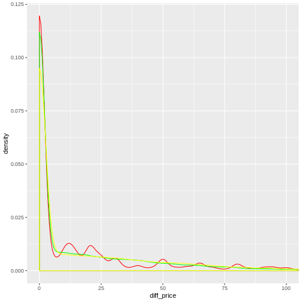

Empirical Distribution of Price Disparity on Leads Market
========================================================
author: Lucius Hu
date: Dec. 2019
autosize: true

Introduction
========================================================
- Generally speaking, the market price of a good/service
  shall equal to its value.
- On the leads market, sellers of leads hold information
  of potential clients for certain financial products,
  such as pay-day loans. Buyers are financial service
  providers.
- Certain information on a client is public to all buyers
  and they evaluate the information to form a estimate
  on expected return from a client.
- Buyers bid simultaneously and the one with highest-bid
  wins the lead.

Theoretical Model
========================================================
- The expected return for bidder $i$ from a lead $j$ is
$$
\mathbb{E}\left[\pi_{ij}\right] =
\left(\prod_{j^\prime\in\mathcal{J}\setminus \{j\}}
\text{Pr}\left(p_{ij^\prime}< p_{ij}\right)\right) \cdot 
\left(k_i \cdot r_{ij} - p_{ij}\right)
$$
- If all bidders are identical, the theory implies that
  they would all offer the same price that equals to the
  expected return.
- But if the return is idiosyncratic, their offer price
  would be different, but still equal to their own expected
  return.
- $r_{ij}$ is likely to be a private knowledge only to
  bidder himself. But assume its distribution is known
  to all bidders s.t.
$$
r_{ij}\stackrel{i.i.d.}{\sim}F\left(r\right),\,
\forall\,i\in\mathcal{I},\,j\in\mathcal{J}.
$$

Theoretical Model (Cont.)
========================================================
- Then we can rewrite
$$
\begin{aligned}
\prod_{j^\prime\in\mathcal{J}\setminus \{j\}}
\text{Pr}\left(p_{ij^\prime}< p_{ij}\right)
& = \prod_{j^\prime\in\mathcal{J}\setminus \{j\}}
\text{Pr}\left(P\left(r_{ij^\prime}\right)< p_{ij}\right) \\
& = \prod_{j^\prime\in\mathcal{J}\setminus \{j\}}
\text{Pr}\left(r_{ij^\prime}< P^{-1}\left(p_{ij}\right)\right) \\
& = \prod_{j^\prime\in\mathcal{J}\setminus \{j\}}
F\left(P^{-1}\left(p_{ij}\right)\right) \\
& = F\left(P^{-1}\left(p_{ij}\right)\right)^N
\end{aligned}
$$
- Let $G\left(r\right)\equiv F_N\left(r\right)$, then
\(
\mathbb{E}\left[\pi_{ij}\right] =
G\left(P^{-1}\left(p_{ij}\right)\right) \cdot
\left(k_i\cdot r_{ij}-p_{ij}\right).
\)

Theoretical Model (Cont.)
========================================================
- It follows that
\(
\frac{\partial\ \mathbb{E}\left[\pi_{ij}\right]}{\partial\ p_{ij}} =
\frac{g\left(P^{-1}\left(p_{ij}\right)\right)}
{P^{\prime}\left(P^{-1}\left(p_{ij}\right)\right)}\cdot
\left(k_i\cdot r_{ij}-p_{ij}\right)-G\left(P^{-1}\left(p_{ij}\right)\right),
\)
- Since in equilibrium, $p_{ij}^*=P\left(r_{ij}\right)$, then
$$
\begin{aligned}
0 =\,&
\frac{\partial\ \mathbb{E}\left[\pi_{ij}\right]}
{\partial\ p_{ij}}\Bigg|_{p_{ij}=p_{ij}^*} \\
=\,\,&
\frac{g\left(r_{ij}\right)}
{P^\prime\left(r_{ij}\right)}\cdot
\left(k_i\cdot r_{ij}-P\left(r_{ij}\right)\right)-G\left(r_{ij}\right)\\
=\,\,&
G\left(r_{ij}\right)\cdot P^\prime\left(r_{ij}\right) +
g\left(P_{ij}\right)P\left(r_{ij}\right)
- k_i\cdot r_{ij}\cdot g\left(r_{ij}\right)\\
=\,\,&
\frac{\partial}{\partial r}\Big(G\left(r\right)\cdot
P\left(r\right)\Big)\Bigg|_{r=r_{ij}}
- k_i\cdot\frac{\partial}{\partial r}
\int_{-\infty}^{r_{ij}}{r\cdot g\left(r\right)\,\mathbb{d}\,r},
\end{aligned}
$$

Theoretical Model (Cont.)
========================================================
- By Leibniz's rule,
\(
P\left(r_{ij}\right)
= \frac{k_i}{G\left(r_{ij}\right)}
\int_{-\infty}^{r_{ij}}{r\cdot g\left(r\right)\,\mathbb{d}\,r}
= k_i\cdot\mathbb{E}\left[r_i^{\left(1\right)}
\Big| r_i^{\left(1\right)}\le r_{ij}\right],
\)
  where
\(r_i^{\left(1\right)}
\equiv\max_{j^\prime\in\mathcal{J}\setminus j}{r_{ij^\prime}}\)
  is the greatest return from $i$ in all bidders.
- Assume $r_{ij}$ having an additive structure, i.e.
  $r_{ij}=r_{i}+\rho_{ij}$, where $r_i$ depends only on
  attributes of a lead, and $\rho_{ij}$ is only known to
  bidder himself
- Let $\rho_i^{\left(k\right)}$ be the $k$-th greatest 
  idiosyncratic return
$$
\begin{aligned}
&\,\mathbb{E}\left[r_i^{\left(1\right)}\Big|
r_i^{\left(1\right)}\le r_{ij}\right] \\
=&\,\mathbb{E}\left[r_i+\rho_i^{\left(1\right)}\Big|
r_i+\rho_i^{\left(1\right)}\le r_i+\rho_j\right] \\
=&\,\mathbb{E}\left[r_i+\rho_i^{\left(1\right)}\Big|
\rho_i^{\left(1\right)}\le \rho_j\right] \\
=&\,r_i+\mathbb{E}\left[\rho_i^{\left(1\right)}\Big|
\rho_i^{\left(1\right)}\le \rho_j\right].
\end{aligned}
$$

Theoretical Model (Cont.)
========================================================
- Then the optimal pricing strategy is
$$
P\left(r_{ij}\right)=k_i\cdot r_i +
k_i\cdot\mathbb{E}\left[\rho_i^{\left(1\right)}\Big|
\rho_i^{\left(1\right)}\le \rho_j\right].
$$
- The difference in the offer price is explained by the
  last term.
- Inspired by the Additive Random Utility Model, let's
  assume the last term, namely the conditional expectation,
  follows a Gumbel distribution or a normal distribution.

Estimation
========================================================

```r
require(data.table)
require(fitdistrplus)
require(ggplot2)
dt = fread(file = "./trainning.csv")
diff_price <- dt[, .(left = ifelse(Win == 0, WinningBid - OfferPrice, NA),
                           right= ifelse(Win == 0, WinningBid - OfferPrice, 0))]
```

Estimation (Cont.)
========================================================

```r
logis_diff_price <- fitdistcens(diff_price, distr = "logis")
normal_diff_price <- fitdistcens(diff_price, distr = "norm")

sim_logis <- rlogis(nrow(diff_price),
                    location = summary(logis_diff_price)$estimate[1],
                    scale = summary(logis_diff_price)$estimate[2])
sim_norm <- rnorm(nrow(diff_price),
                  mean = summary(normal_diff_price)$estimate[1],
                  sd = summary(normal_diff_price)$estimate[2])
sim_data <- data.table(sim_logis, sim_norm, 
                       diff_price = diff_price$right)
sim_data[, `:=` (sim_logis = ifelse(sim_logis >= 0, sim_logis, 0),
                 sim_norm = ifelse(sim_norm >= 0, sim_norm, 0))]
```

Estimation (Cont.)
========================================================

```r
ggplot(sim_data) +
  geom_density(aes(diff_price), colour = "red") + 
  geom_density(aes(sim_logis), colour = "green") + 
  geom_density(aes(sim_norm), colour = "yellow") +
  coord_cartesian(xlim = c(0, 100))
```


